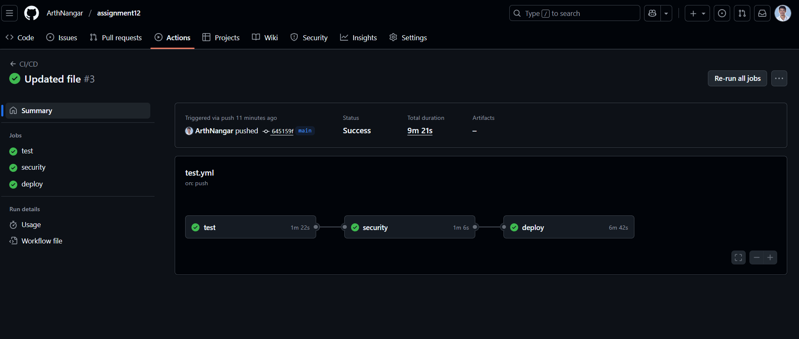
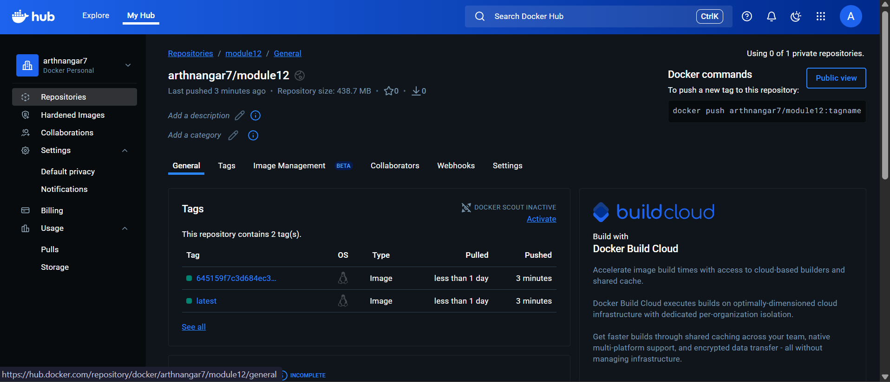
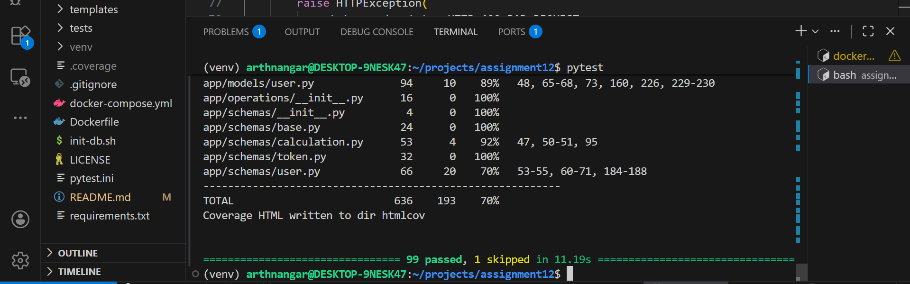

# FastAPI User Authentication & Calculator API – Module 12  
Backend with User Routes, Calculation CRUD, Integration Testing & CI/CD

This project implements a FastAPI backend with:

- User registration and login
- Calculation BREAD operations (Browse, Read, Edit, Add, Delete)
- PostgreSQL database integration
- Integration and unit tests using pytest
- CI/CD with GitHub Actions and Docker Hub


---

## Project Overview

This project demonstrates:

- User authentication with hashed passwords
- REST API for managing calculations
- Pydantic schemas for validation and serialization
- SQLAlchemy models for users and calculations
- Integration tests that use a real PostgreSQL instance in CI
- Automatic Docker image builds and pushes on successful tests

---

## Features

### User Management

- `POST /users/register` – Register a new user
- `POST /users/login` – Login with email/username and password
- Passwords are stored as secure hashes
- Authentication helpers wired through `app/auth/`

### Calculation Operations (BREAD)

- `GET /calculations` – Browse all calculations
- `GET /calculations/{id}` – Read a single calculation by ID
- `POST /calculations` – Add a new calculation
- `PUT /calculations/{id}` or `PATCH /calculations/{id}` – Edit an existing calculation
- `DELETE /calculations/{id}` – Delete a calculation

The calculation routes use the existing `Calculation` model and Pydantic schemas (e.g., `CalculationCreate`, `CalculationRead`).

### Technical Highlights

- FastAPI for API layer
- PostgreSQL as the database
- SQLAlchemy ORM models for `User` and `Calculation`
- Pydantic schemas in `app/operations/schemas`
- Integration and unit tests with pytest
- Dockerfile and docker-compose for containerized local setup
- GitHub Actions workflow that runs tests and pushes Docker images

---

## Project Structure

```text
.github/
└── workflows/
    └── test.yml

.vscode/
└── settings.json

app/
├── __init__.py
├── main.py
├── database.py
├── database_init.py
│
├── auth/
│   ├── __init__.py
│   ├── dependencies.py
│   ├── jwt.py
│   └── redis.py
│
├── core/
│   ├── __init__.py
│   └── config.py
│
├── models/
│   ├── __init__.py
│   ├── calculation.py
│   └── user.py
│
└── operations/
    ├── __init__.py
    └── schemas/
        ├── __init__.py
        ├── base.py
        ├── calculation.py
        ├── token.py
        └── user.py

tests/
├── __init__.py
├── conftest.py
│
├── e2e/
│   ├── __init__.py
│   ├── test_e2e.bk
│   └── test_fastapi_calculator.py
│
├── integration/
│   ├── __init__.py
│   ├── test_calculation_schema.py
│   ├── test_calculation.py
│   ├── test_database.py
│   ├── test_dependencies.py
│   ├── test_schema_base.py
│   ├── test_user_auth.py
│   └── test_user.py
│
└── unit/
    ├── __init__.py
    └── test_calculator.py
docker-compose.yml  
Dockerfile  
init-db.sh  
pytest.ini  
LICENSE  
README.md  
requirements.txt  

```

## 🚀 Getting Started (Local Development)
```

1. Prerequisites Python 3.10+
2. Docker Desktop (for PostgreSQL + Docker image)
3. Git

Clone the Repository

git clone https://github.com/ArthNangar/assignment12.git
cd assignment12

Create and Activate a Virtual Environment

python -m venv venv
source venv/bin/activate      # macOS / Linux
# OR
venv\Scripts\activate         # Windows

Install Dependencies

pip install -r requirements.txt

Start PostgreSQL (Local)
You can either use your own PostgreSQL instance or run one with Docker:

Configure Environment Variables
Create a .env file in the project root:

To run the app: 
python main.py


Running the Tests:--

1. Run All Tests
pytest

2. Run Only Unit Tests

pytest tests/unit

```


##  CI/CD – GitHub Actions & Docker Hub

```
GitHub Actions Workflow (.github/workflows/test.yml)
On each push and pull request to main:

Set up Python

Install dependencies from requirements.txt

Run unit and integration tests with pytest

On success:

Build the Docker image

Push the image to Docker Hub


What CI/CD Pipeline do:

The GitHub Actions workflow automatically runs on every push and pull request.

Test – Executes all unit & integration tests with PostgreSQL service container.

Security – Scans built Docker images using Trivy for vulnerabilities.

Deploy – Builds and pushes the Docker image to Docker Hub upon successful tests.

```

## Required GitHub Secrets
DOCKERHUB_USERNAME

DOCKERHUB_TOKEN

The Docker image for this project is published to:

👉 Docker Hub: https://hub.docker.com/repository/docker/arthnangar7/module12


## Screenshots

### ✅ GitHub Actions – Successful CI/CD Run


### 🐳 Docker Hub – Image Successfully Pushed


### 🧪 Tests – All Passed with Coverage



## License

This project is licensed under the MIT License. See the LICENSE file for details.

## Acknowledgments

FastAPI Documentation

Docker Docs

PostgreSQL Docs

pgAdmin Docs


## 👨‍💻 Author
Arth Nangar

Date: 11/24/2025

Module 12